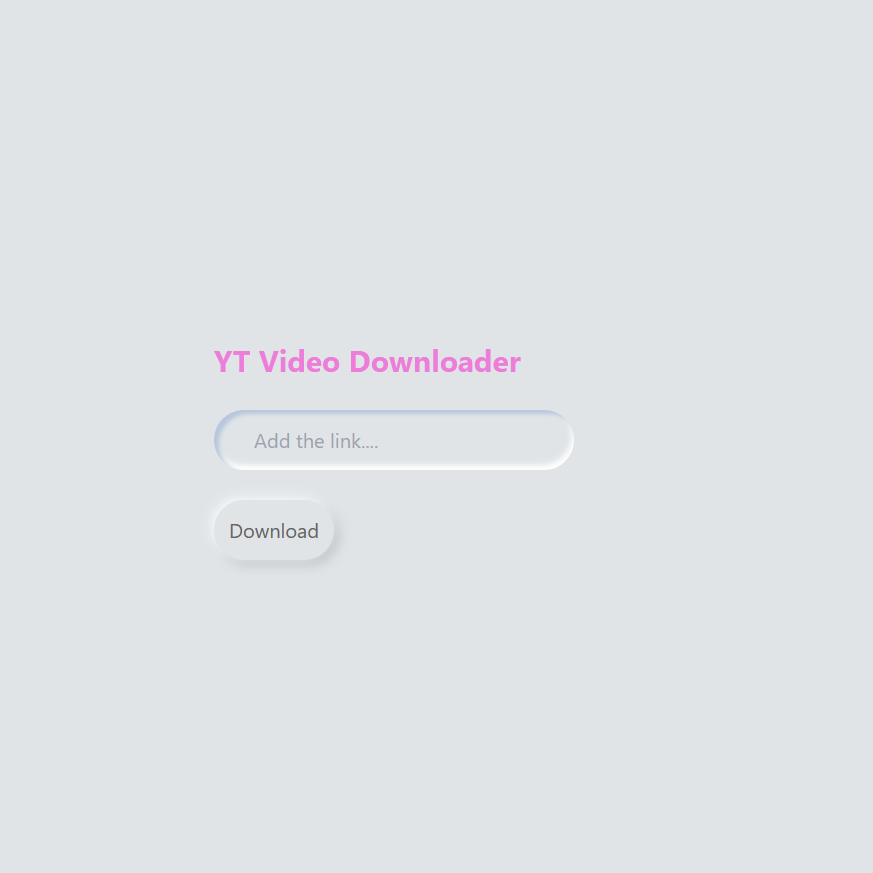

# **YTDownloader**

YTDownloader is a simple YouTube downloader web application built using Django and the Pytube Python library. It allows users to enter the URL of a YouTube video and download it in various formats.



## **Getting Started**

To get started with YTDownloader, you will need to clone this repository to your local machine. You can do this using the following command:

```
git clone https://github.com/tad-ai/YT-Downloader.git
```  

Once you have cloned the repository, you will need to create a Python virtual environment. You can do this by running the following command:
(If you prefer to use the virtual environment included in this repository, you can skip this step.)
```
python -m venv env
```

Next, activate the virtual environment using the following command:
```
source env/bin/activate
```

Then run the following command to install the required dependencies:
```
pip install -r requirements.txt
```

Once you have activated the virtual environment, navigate to the YTDownloader directory using the following command:
```
cd YTDownloader
```

Finally, run the following command to start the Django development server:
```
python manage.py runserver
```

You should now be able to access the YTDownloader application by navigating to http://127.0.0.1:8000/ in your web browser.

## **Usage**

To use the application, simply enter the URL of the YouTube video you want to download into the input field and click the "Download" button. You will be redirected to a page with links to download the video in various formats.

## **Contributing**

Contributions to this project are welcome. If you find a bug or have a feature request, please open an issue on the GitHub repository. If you would like to contribute code, please fork the repository and submit a pull request.

## **License**

This project is licensed under the MIT License. See the `LICENSE` file for details.